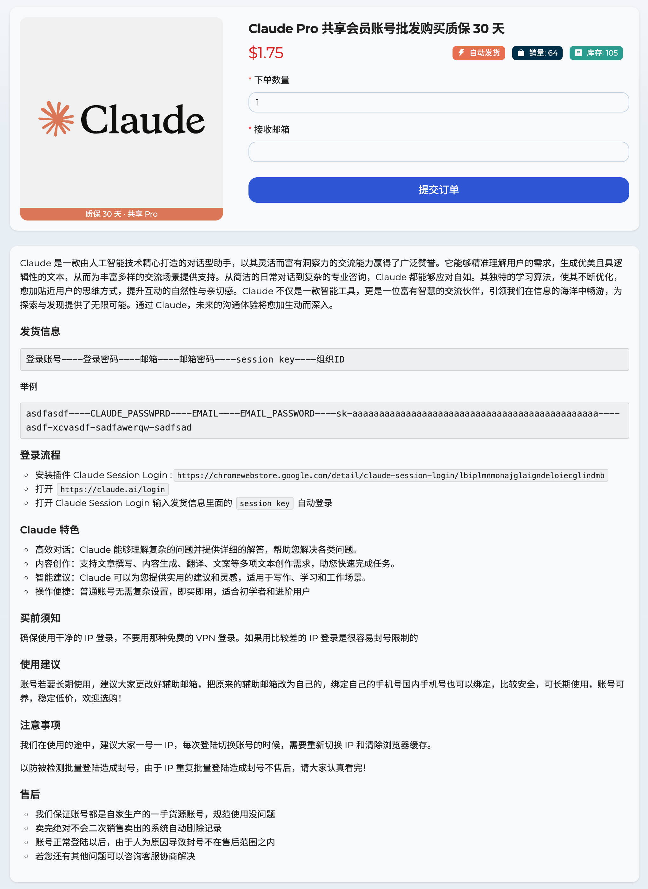

# 免费 Claude AI Pro 会员账号批发购买

平台网址: [https://anyshop.vip](https://anyshop.vip/?_referrer=adgithubbdakx)



Claude 是一款由人工智能技术精心打造的对话型助手，以其灵活而富有洞察力的交流能力赢得了广泛赞誉。它能够精准理解用户的需求，生成优美且具逻辑性的文本，从而为丰富多样的交流场景提供支持。从简洁的日常对话到复杂的专业咨询，Claude 都能够应对自如。其独特的学习算法，使其不断优化，愈加贴近用户的思维方式，提升互动的自然性与亲切感。Claude 不仅是一款智能工具，更是一位富有智慧的交流伙伴，引领我们在信息的海洋中畅游，为探索与发现提供了无限可能。通过 Claude，未来的沟通体验将愈加生动而深入。

##### 发货信息

```
登录账号----登录密码----邮箱----邮箱密码----session key----组织ID
```

举例

```
asdfasdf----CLAUDE_PASSWPRD----EMAIL----EMAIL_PASSWORD----sk-aaaaaaaaaaaaaaaaaaaaaaaaaaaaaaaaaaaaaaaaaaaaaa----asdf-xcvasdf-sadfawerqw-sadfsad
```

##### 登录流程

- 安装插件 Claude Session Login
  :`https://chromewebstore.google.com/detail/claude-session-login/lbiplmnmonajglaigndeloiecglindmb`
- 打开 `https://claude.ai/login`
- 打开 Claude Session Login 输入发货信息里面的 `session key` 自动登录

##### Claude 特色

- 高效对话：Claude 能够理解复杂的问题并提供详细的解答，帮助您解决各类问题。
- 内容创作：支持文章撰写、内容生成、翻译、文案等多项文本创作需求，助您快速完成任务。
- 智能建议：Claude 可以为您提供实用的建议和灵感，适用于写作、学习和工作场景。
- 操作便捷：普通账号无需复杂设置，即买即用，适合初学者和进阶用户
